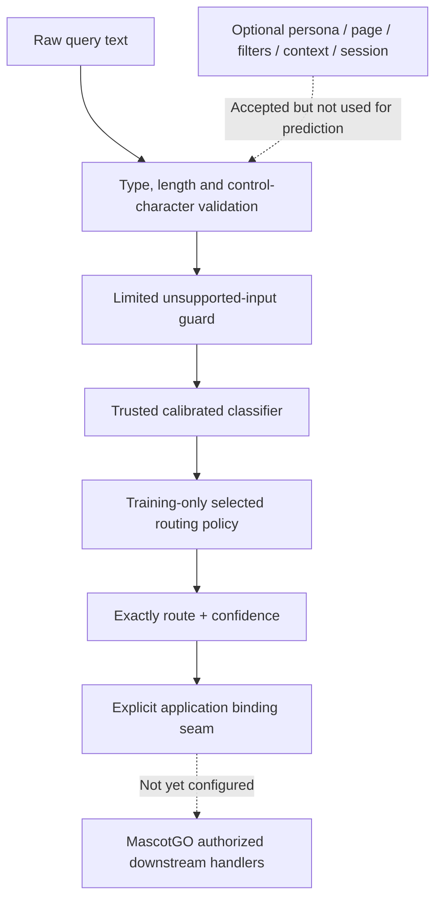

# Architecture and evidence flow

The limited guard is not a complete prompt-injection or language detector. No query can cause this component to call a URL or mutate a database. A downstream lookup must still verify entity resolution, supported fields, freshness and authorization.

```mermaid
flowchart LR
    R[Original review preserved] --> Q[Identity checks and separately attributed semantic adjudication]
    Q --> T[Versioned reviewed pool]
    T --> X[Exclude frozen benchmark families]
    X --> O[Outer grouped OOF with inner grouped calibration]
    O --> S[Save model and policy selection]
    S --> V[Historical regression and frozen diagnostic suites]
    V --> P[Complete predictions, failures, intervals and report]
    P --> G[Quality gate]
    G --> N[No automatic promotion when safety fails]
```

Original V1 bytes are hash-checked before and after the build. The old test is already-observed regression evidence. The new suite was fixed before closeout predictions but is assistant-authored, not independent user validation. External live deployment requires a distinct approval decision.
